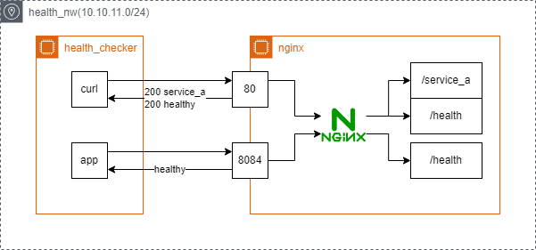

# HealthChecker

## NW



## 使い方

環境の立ち上げ

```console
$ docker compose up -d
```

環境の停止

```console
$ docker compose down --volumes
```

### nginxへのアクセス

#### L7 アプリケーション

```console
$ docker compose exec -it health_checker curl -i http://nginx/service-a.html
HTTP/1.1 200 OK
Server: nginx/1.26.3
Date: Mon, 24 Feb 2025 16:14:27 GMT
Content-Type: text/html
Content-Length: 9
Last-Modified: Fri, 21 Feb 2025 17:10:56 GMT
Connection: keep-alive
ETag: "67b8b3a0-9"
Accept-Ranges: bytes

service-a
```

#### L7 ヘルスチェック

```console
$ docker compose exec -it health_checker curl -i http://nginx/health
HTTP/1.1 200 OK
Server: nginx/1.26.3
Date: Mon, 24 Feb 2025 16:14:10 GMT
Content-Type: application/octet-stream
Content-Length: 8
Connection: keep-alive

healthy
```

#### L4 ヘルスチェック

```console
$ docker compose exec -it health_checker nc nginx 8084
healthy
(待ち状態)
```

切断された場合はヘルスチェック異常。  
ただし、春暖の可能性があるので再接続処理をしてつながらないことの確認が必要。

### ヘルスチェックアプリの使い方

コンテナの起動と同時にソフトウェアは立ち上がる。

ログの確認

```console
$ docker compose exec -it health_checker cat /app/logs/sys.log
```

コンテナの中に入る

```console
$ docker compose exec -it health_checker /bin/bash
```

### nginx（サーバーダウン）

コンテナの起動

```console
$ docker compose up -d
```

ログの確認

```console
$ docker compose exec -it health_checker cat /app/logs/sys.log
{"asctime": "2025-02-24 22:10:45,969", "levelname": "INFO", "message": "Health check passed."}
{"asctime": "2025-02-24 22:10:50,970", "levelname": "INFO", "message": "Health check passed."}
```

サーバーの停止

```console
$ docker stop health_check-nginx-1
health_check-nginx-1
$ docker ps -a
CONTAINER ID   IMAGE                         COMMAND                  CREATED         STATUS                     PORTS     NAMES
39fa565e81fa   health_check-health_checker   "python checker.py"      4 minutes ago   Up 3 minutes                         health_check-health_checker-1
6c7b48842111   health_check-nginx            "/docker-entrypoint.…"   4 minutes ago   Exited (0) 3 minutes ago             health_check-nginx-1
```

ログの確認

```console
$ docker compose exec -it health_checker cat /app/logs/sys.log
{"asctime": "2025-02-24 22:10:45,969", "levelname": "INFO", "message": "Health check passed."}
{"asctime": "2025-02-24 22:10:50,970", "levelname": "INFO", "message": "Health check passed."}
{"asctime": "2025-02-24 22:11:03,793", "levelname": "ERROR", "message": "Connection error: [Errno -2] Name or service not known"}
{"asctime": "2025-02-24 22:11:16,794", "levelname": "ERROR", "message": "Connection error: [Errno -3] Temporary failure in name resolution"}
{"asctime": "2025-02-24 22:11:29,797", "levelname": "ERROR", "message": "Connection error: [Errno -3] Temporary failure in name resolution"}
```

### health_server

```console
$ docker compose exec -it health_checker nc health_server 84import os
/health
healthy
(待機)
```

```console
$ docker compose exec -it health_checker nc health_server 84import os
/app
hello
(待機)
```
